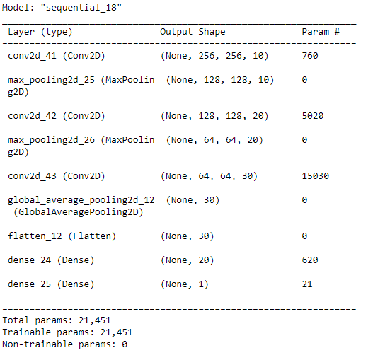

# MVP
## Matt Ryan

For the minimum viable product for this project, I have created a basic convolutional neural net model trained on a dataset of 746 .png files represent CT scans of lungs (around half COVID positive, half COVID negative). The layers of this model are as follows:

The model was trained on an 80% hold-out set of the entire dataset over 10 epochs, and then used to predict whether or not the lung CT scan represented a COVID positive patient or not. After training the model, it predicted the presence of COVID-19 in lungs with a 48.9% accuracy. 

Going forward, the intention is to both build a decision-tree base model and use transfer learning on an existing trained model from Keras with our dataset and then compare.